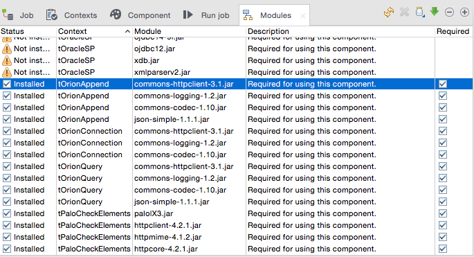
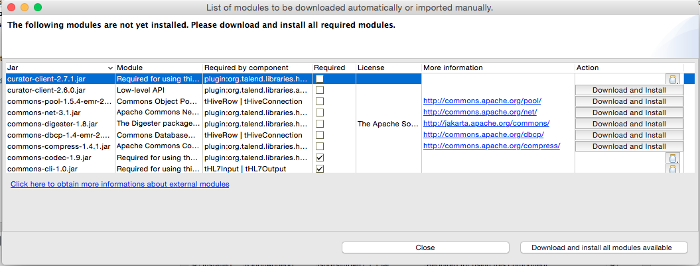

# Installing required libraries
This section of the manual describes how to install the libraries the custom components developed for Telefónica's IoT Platform may require once [installed](./configuring_tos.md) in Talend Open Studio (TOS)

It is supposed a TOS is already installed. It is not in the scope of this document to guide you through the installation process. Please, check the Talend [documentation](https://www.talend.com/download/talend-open-studio). It is important to download and install the Data Integration flavour of TOS.

[Top](#top)

## Checking the required libraries
There is a viewer under the *Integration* perspective called *Modules* that can be used for checking is the required dependencies by all the TOS components are satisfied or not. This viewer can be found under *Window > Show view > Talend > Modules* in the menu. A tab like the following one should be opened:

As can be seen, all the dependencies related to all the components are shown, including their status (installed or not) and if it is required or not.

For the time being, the custom components developed for Telefónica's IoT Platform require the following libraries:

* `commons-httpclient`,  version 3.1
* `commons-logging`,  version 1.2
* `commons-codec`, version 1.10
* `json-simple`,  version 1.1.1

[Top](#top)

## Missing libraries installation
When a library is not installed, click on the green arrow appearing in the top right corner of the  *Modules* viewer; a new window should be opened, showing all the missing libraries:

Please observe there are two possibilities: the library can be automatically downloaded by TOS itself, through a *Download and Install* button; or the library must be found in the file system, by clicking on a jar icon.

[Top](#top)

### The library can be automatically downloaded by TOS
This occurs when TOS is able to find the library on Talend website. None of the libraries required by the custom components develop for Telefónica's IoT Platform will be found this way, so check the next section.

[Top](#top)

### The library must be found in the file system
This occurs when TOS is not able to find the library on Talend website. In this case, the Java .jar file implementing the library must be found by the administrator him/herself and copied somewhere in the file system in order it can be selected.

Regarding the .jar files required by the custom components develop for Telefónica's IoT Platform, there are two options:

* Download the .jar files from the Internet. [MVN Repository](https://mvnrepository.com/) is a good reference.
* Use the distributed .jar file within the component zip downloaded from Talend Exchange.

Github [sources](https://github.com/telefonicaid/iotp-talend-connectors) don't provide any copy of the required .jar files.

[Top](#top)

## Further details
Please, check the Official Talend Help Center [page](https://help.talend.com/display/KB/How+to+install+external+modules+in+the+Talend+products) detailing how to install external modules.

