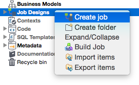
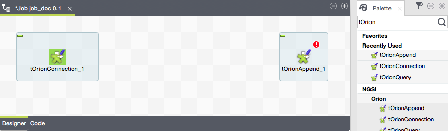
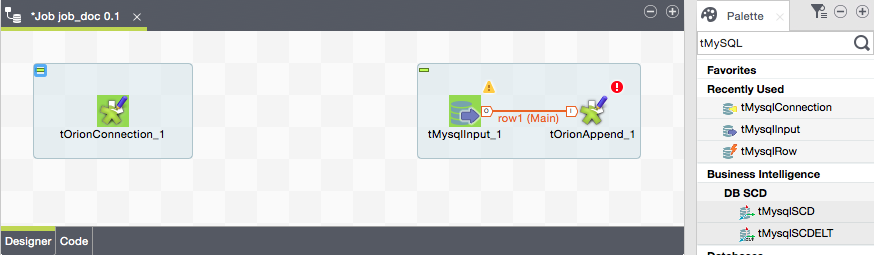
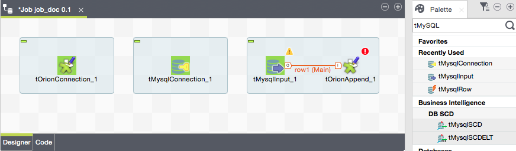
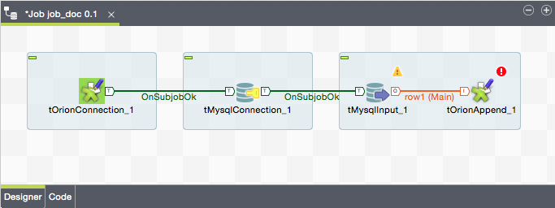
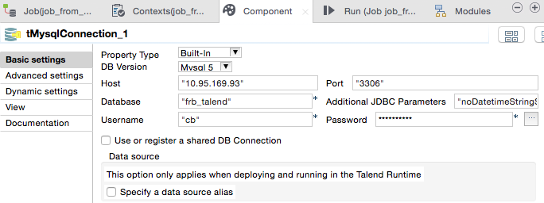
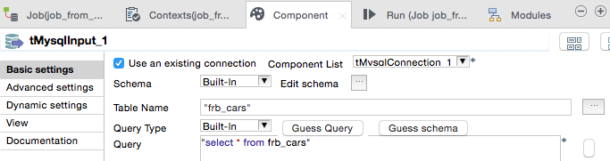
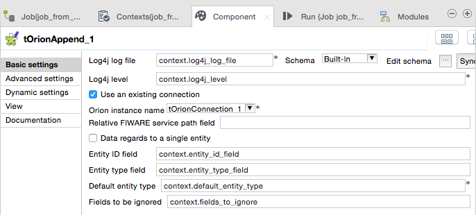
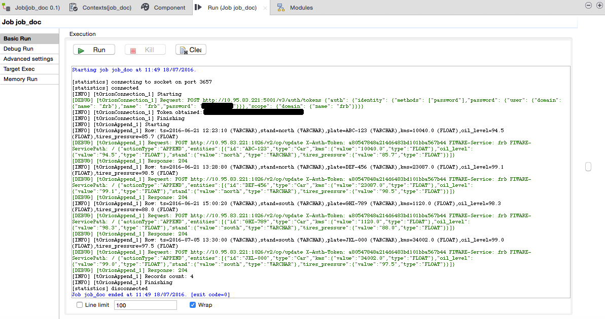

#Appending data
##Job definition
Start by creating a new job if you did not create it yet:

Optionally, please consider [using](./creating_orion_connection.md) a `tOrionConnection` component containing all the necessary configuration about connecting to a FIWARE service within a real Orion endpoint. If not, such a configuration will have to be added to the appending component:

* Log4j log file.
* Log4j level.
* Http-like Orion service endopoint, typically running on TCP/1026 port.
* Http-like Keystone authentication endpoint.
* Username to be authenticated in the FIWARE service.
* Password for the above username.
* FIWARE service we want to connect to.
* FIWARE service path.

The benefit of using `tOrionConnection` is its configuration can be reused by many other <i>NGSI/Orion</i> components. This guide will assume `tOrionConnection` is being used.

In the palette, within the package <i>NGSI/Orion</i>, there is a Talend component, `tOrionAppend`, in charge of appending incoming records to an Orion endpoint. Simply drag and drop it to the job design window. This will automatically create a subjob for this unique component, in addition to the already existent subjob for `tOrionConnection`:

Because `tOrionAppend` needs data records at its input, a MySQL reader will be added to the subjob in the form of the `tMySQLInput` native Talend component; this component will be in charge of providing data, row by row, from MySQL tables to `tOrionAppend`. As can be seen, the output of `tMySQLInput` has been connected to the input of `tOrionAppend`:

A third subjob, based on a `tMySQLConnection` component, is required for establishing a connection to the real MySQL endpoint; then, this connection will be reused by `tMySQLInput` (this case is similar to the `tOrionConnection` subjob):

Then, these three subjobs are chained by means of triggers:

* `tOrionConnection` triggers `tMySQLConnection` on "subjob OK".
* `tMySQLConnection` triggers `tMySQLInput` on "subjob OK".

##Components configuration
###`tOrionConnection` configuration
This is assumed to be already configured. Check the [documentation](./creating_orion_connection.md) for further details.

###`tMySQLConnection` configuration
Simply configure the host, port, database, username and password for MySQL:

###`tMySQLInput` configuration
Simply use the above MySQL connection, and configure the table name:

It is important to guess the schema at this time, and propagate it to `tOrionAppend`.

###`tOrionAppend` configuration

First of all, it is necessary to select an existent Orion connection (`tOrionConnection_1` of type `tOronConnection`) if we want to get access to its configuration (i.e. service and authentication endpoints, authentication credentials and FIWARE service and service path).

For each record received at the input of the the component, a Json string is created and sent to Orion as the payload of a `/v2/op/update` operation; such an operation will create a NGSI entity if not existing, or will update the NGSI entity if existing yet. In order to create the Json payload, it must be specified which fields among the ones in the schema match to the following:

* The relative FIWARE service path to be added to the configured FIWARE service path. If not configured, nothing will be added.
* The entity ID. If not configured, the the default hardcoded value is used (`ID` + an incremental number starting by 0).
* The entity type. If not configured, then the default configured value is used.

All the other fields in the schema are assumed to be attributes. Neverhteless, it is possible to define a set of fields to be ignored; they are specified as a comma-separated list.

Please observe the component allows considering all the records to be related to a single entity. In this case, the ID and type are not expected to be found in the data but they are directly configured in `tOrionAppend`.

Please observe as weel the Contexts tab has been used in order to centralize the configuration:

##Running
Running the above job results in the following output:

As can be seen, first of all an authentication token is obtained for the configured FIWARE service and credentials in `tOrionConnection`. That token is then attached as a `X-Auth-Header` to all the NGSIv2 requests sent to the Orion endpoint configured in `tOrionConnection` as well.

Requests are of type `/v2/op/update`, as previously said. There is one request per each record (MySQL row) read, and its payload is a Json string built from the record data and based on the field mappings (and the default values) detailed in `tOrionAppend`.

##Further reading
More details about `tOrionAppend` can be found in the [<i>Talend Components Catalogue</i>](../talend_components_catalogue/t_orion_append.md).