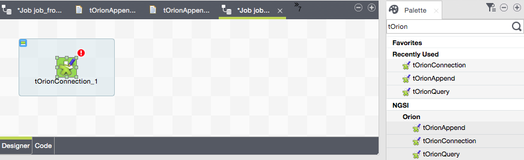

#Creating an Orion connection
Creating an Orion connection means binding to a certain FIWARE service among all the services handled by a real Orion endpoint, by means of a Keystone token that only an authenticated and authorized user in that FIWARE service is able to obtain.

Creating this kind of connection is not mandatory, but highly recommended in terms of configuration reusing. If not used, most of the configuration details needed in the connection will have to be replicated in every Orion-related Talend component.

Start by creating a new job if you did not create it yet:

In the palette, within the package <i>NGSI/Orion</i>, there is a Talend component, `tOrionConnection`, in charge of defining all the required details for an Orion connection:

* Log4j log file.
* Log4j level.
* Http-like Orion service endpoint, typically running on TCP/1026 port.
* Http-like Keystone authentication endpoint.
* Username to be authenticated in the FIWARE service.
* Password for the above username.
* FIWARE service we want to connect to.
* FIWARE service path.

Simply drag and drop the `tOrionConnection` component from the Palette to the job design window. This will automatically create a subjob for this unique component:

Now, it is time to configure it through the basic settings (Component tab):

Please observe the Contexts tab has been used in order to centralize the configuration:

As said, once created this `tOrionConnection` many other components from <i>NGSI/Orion</i> will be able to reuse its configuration.

More details about `tOrionConnection` can be found in the [<i>Talend Components Catalogue</i>](../talend_components_catalogue/t_orion_connection.md).
